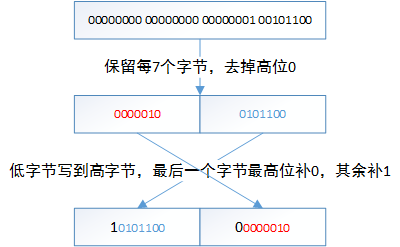

### Base 128 Varint编码

**Varint 是什么？**

Varint 编码是一种可变长的编码方式，值越小的数字，使用越少的字节数表示。它的原理是通过减少表示数字的字节数从而实现数据体积压缩。

编码规则：
最高位(most significant bit)表示编码是否继续，如果该位为1，表示接下来的字节仍然是该数字的一部分，如果该位为0，表示编码结束。字节里的其余7位用原码补齐，采用低位字节补齐到高位的办法。

首先，先理解几个概念，因为后面需要用到这些概念：

- field-number：如以下 message 中的最后一列的数字；
- wire-type：编码类型，比如 Varint 的编码类型为 0；
- msb：全称 most significant bit，指的是每个字节的最高位 （例如：0x80 的 二进制是 10000000，其最高位是 1，即 msb 为 1）。

然后，我们看 Varint 是怎样编码的，先了解一下 Tag信息 和 Data信息：

- Tag 信息：主要存储 field-number 和 wire-type；
- Data 信息：编码后的序列。

> Varint 编码序列 = Tag信息 + Data信息。

**Tag 信息**

使用一个字节来表示 Tag 信息(当$field-number \le 15$时)，高 5 位表示 field-number，低 3 位表示 wire-type。

```
 [7] [6] [5] [4] [3] [2] [1] [0]
|<----- field ----->|<-- wire ->|
        number           type
```

**Data 信息**
在 C++ 中，int 类型的编码是固定的，无论数值大小，都使用固定 4 个字节来存储。假如数值为 1，二进制为 00000000 00000000 00000000 00000001，其实有效值只有最后一个字节 00000001，前三个字节是浪费的。

对数字1进行varint编码后的结果为0000 0001，占用1个字节。相比int32的数字1存储占用4个字节，节省了3个字节的空间（主要是高位的0），而Varint的想法就是 以标志位替换掉高字节的若干个0。

下面我们分析一个具体的例子:

int32 类型的 i32 字段（field-number 为 1），其值为 300 的时候，编码结果为 08 ac 02，怎么得来的？

其中0x08是Tag字段:
```
元数据 (field-number << 3 | wire-type) = (1 << 3 | 0) = 0x08
```

而0xac02是Data字段:
```
i32的值为 300
|__ 0x012c             //十六进制
|__ 00000001 00101100  //二进制
|__ 0000000100101100   //合并
|__ 00 0000010 0101100 //重新按7位一组切割
|__ 0000010 0101100    //高位全0的组省略
|__ 0101100 0000010    //逆序，因为使用小端字节序，
|__ 10101100 00000010  //每一组加上msb，除了最后一组是msb是0，其他的都为1
|__ ac 02              //十六进制
```


我们可以通过示例程序验证一把:
```
$ cd cxx
$ ./build_proto.sh
$ make
$ ./test
==== test_1 ====:
08 ac 02
$ cd ..
$ python3 base_128_varint_encode.py 300
bits list:  ['00000010', '10101100']
little endian in memory: ac 02
```

